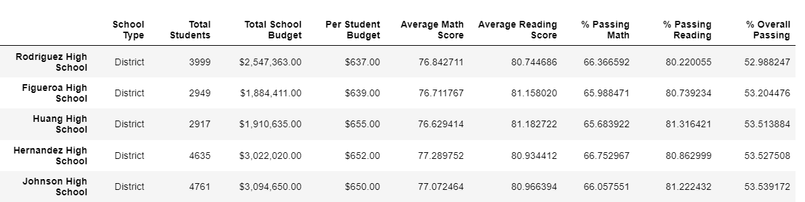

# PyCitySchool Challenge

## Overview and Purpose
This project has been undertaken by Maria, the chief Data Scientist for city schools district to analyze the data on various schools’ performance and provide insights to the School Board on performance trends and patterns. We have analyzed each school’s performance data based on the students’ math and reading scores, per student budgets, type of schools and the size of the schools. Theses insights will help the School Boards at state and district levels make strategic decisions next year regarding budget allocations. However, after the initial analysis was sent to the School Board, they suspected a case of academic dishonesty with one of the school’s math and reading grades, Thomas High School. Therefore here we have replaced the math and reading scores for Thomas High School ninth graders with NaNs while keeping the rest of the dataset intact and repeated the school district analysis.

## Results

#### District Summary
At the district level, there has not been any significant change after replacing the math and reading scores for Thomas High School ninth graders with NaN. 
- Total students and total budget remains the same
- Average math score has changed from 79 to 78.9
- Average reading score has remained the same
- % Passing Math has reduced from 75% to 74.8%
- % Passing Reading has reduced from 86% to 85.7%
- % Overall Passing has reduced from 65% to 64.9%

#### School Summary
The per school summary shows the performance of each school by calculating the total students, total budget, per student budget, average math score, average reading score, % passing math,% passing reading and % overall passing. Here we calculated the % passing Math, % Passing Reading and % overall Passing for all schools with the new total student count that excluded the students in the 9th grade from Thomas High School whose scores were changed to Nan. 

- The total new student count was 38,709
- The % Passing Math column values have changed from 93.27% to 66.91% for Thomas High School
- The % Passing Reading column values have changed from 97.31% to 69.66% for Thomas High School
- The % Overall Passing column values have changed from 90.95% to 65.08% for Thomas High School

From this data, we can see that when we remove the ninth grade students of Thomas High School and recalculate the school performance based on the new student count, there is a significant drop in the performance of Thomas High School as compared to the other schools.

#### Top 5 schools:

After replacing the math and reading scores of ninth graders at Thomas High School with NaN and performing the analysis based on the new student count that excludes the ninth grade students of Thomas High School, we can see that Thomas High School's position has been dropped from the second place and replaced by Griffin High School.

#### Bottom 5 schools:

Replacing the ninth graders scores at Thomas High School did not have any effect on the 5 lowest performing schools.

#### Math & Reading Scores By Grade

The per_school_summary_original_df dataframe analyzes the data after we have replaced the ninth grade math and reading scores with Nan but have not replaced the school summary dataframe with new passing percentages for 10th to 12th graders for Thomas High School as instructed in steps 5 to 12.
In this case, 
- math by grade score shows NaN for Thomas High School 9th graders.

- reading by grade also shows NaN for Thomas High School 9th graders.

#### Scores By School Spending

In terms of spending range per student, the schools whose per student budget ranges between $631 -645 were affected.
- % Passing Math reduced from 73% to 67% 
- % Passing Reading reduced from 84% to 77% 
- % Overall Passing reduced from 63% to 56%

#### Scores By School Size

In terms of school size, there were no changes in scores for small and large schools.Only the scores for medium schools have been affected.
- % Passing Math reduced from 94% to 88%
- % Passing Reading reduced from 97% to 91% 
- % Overall Passing reduced from 91% to 85%

#### Scores By School Type

In terms of school type, only the scores at Charter level have been affected while the District level remains unchanged.
- %Passing Math reduced from 94% to 90%
- % Passing reading reduced from 97% to 93%
- % overall Passing reduced from 90% to 87%

#### Summary

Therefore we can conclude that although Thomas High School’s performance remains consistent when we analyze the data based on grades 10 to 12, we can see a significant drop in their overall performance relative to the other schools as we exclude the data about their 9th grade students. Since Thomas High School is a charter school, there has been a decrease in performance of charter schools although their overall average performance is much better compared to the district schools. When analyzed by school size, we can see a drop in performance for medium schools although their overall average performance is much better than large schools. In terms of school budget per student, the data shows that schools with the lowest budget per student have the highest overall performance on an average. Cabrera High school ranks first in terms of overall performance while Johnson High School has the lowest overall passing rate on an average.

Please click here to retrieve the codes for the initial analysis. [Click Here](https://github.com/Sukanya807/PyCitySchools_Challenge/blob/main/PyCitySchools.ipynb)

Please click here to retrieve the codes for the final challenge analysis. [Click Here](https://github.com/Sukanya807/PyCitySchools_Challenge/blob/main/PyCitySchools_Challenge_Final.ipynb)

